# Microservices Interview Answers

This document answers the questions from `Microservices_Common_Interview_Questions.md`.

---

## Part 1

# Microservices Interview Answers (Part 1)

This document answers the questions from `../../Microservices_Common_Interview_Questions.md`.

## Table of Contents

- [Microservices Fundamentals](#microservices-fundamentals)
- [API Design & Contracts](#api-design--contracts)
- [Communication Patterns](#communication-patterns)
- [Data & Transactions](#data--transactions)
- [Consistency, Ordering, Idempotency](#consistency-ordering-idempotency)
- [Resilience & Fault Tolerance](#resilience--fault-tolerance)

**Answer format per question**
- What it is
- Why we use it
- How it works / key features
- Advantages
- Disadvantages / tradeoffs
- If we don’t use it (impact)
- Diagram (Mermaid)

---

## Microservices Fundamentals

### Q1) What is microservices architecture?
**What it is**
- An architectural style where a system is composed of **small, autonomous services**, each aligned to a **business capability** (often a DDD bounded context).
- Services are **independently deployable** and communicate via **network calls** (HTTP/gRPC) and/or **messaging** (Kafka/RabbitMQ).

**Why we use it**
- To enable **team autonomy**, **independent releases**, and **scaling** parts of the system independently.

**How it works / key features**
- **Service boundary**: business capability (Orders, Payments, Inventory).
- **Independent lifecycle**: build, test, deploy, scale per service.
- **Decentralized data**: commonly database-per-service.
- **Automation**: CI/CD, containers, orchestration (Kubernetes).
- **Observability**: logs/metrics/traces are mandatory to operate.

**Advantages**
- Independent deployments and faster delivery.
- Scaling hot services without scaling the whole system.
- Fault isolation (when designed with resilience patterns).
- Allows different tech choices where justified.

**Disadvantages / tradeoffs**
- Distributed-systems complexity (latency, partial failures, retries).
- Data consistency becomes harder (eventual consistency, sagas).
- Higher ops overhead (CI/CD, observability, on-call).
- Debugging complexity (needs tracing and correlation IDs).

**If we don’t use it (impact)**
- With a monolith/modular monolith you often get:
  - Simpler transactions and debugging.
  - Lower ops overhead.
- But you may face:
  - Slower releases due to coordination.
  - Harder independent scaling.
  - Larger blast radius on deployments.

**Diagram**
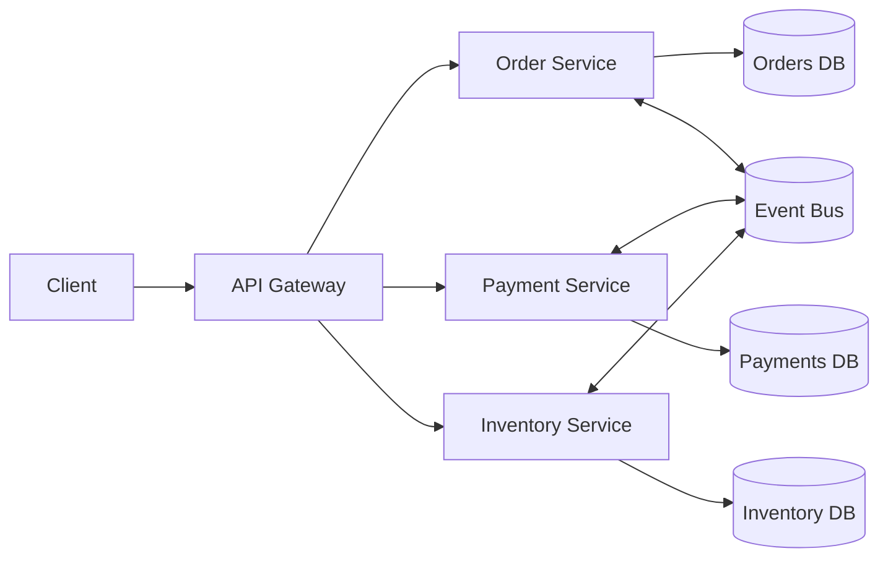

---

### Q2) Why microservices over monolith? What are the tradeoffs?
**What it is**
- A decision/tradeoff analysis between a single deployable unit (monolith) vs multiple autonomous services (microservices).

**Why we use microservices**
- Independent delivery by multiple teams.
- Independent scaling and fault isolation.

**How it works / key features**
- Organizational: teams own services end-to-end.
- Technical: network boundaries, independent data, CI/CD.

**Advantages (microservices)**
- Independent releases.
- Smaller codebases per service.
- Polyglot options.
- Better scaling granularity.

**Disadvantages (microservices)**
- Distributed failures and latency.
- Complex data consistency.
- Complex test strategy (contract/E2E).
- Requires mature ops and observability.

**If we don’t use microservices (impact)**
- With a monolith you simplify:
  - Transactions
  - debugging
  - local development
- But risk:
  - slower release trains
  - scaling everything together
  - large deployments with big blast radius

**Diagram**
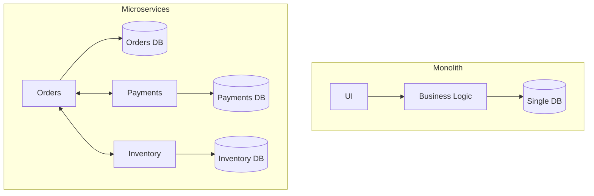

---

### Q3) What is a modular monolith and when is it better than microservices?
**What it is**
- A **single deployable** application with **strong internal module boundaries** (packages/modules), clear ownership, and limited coupling.

**Why we use it**
- To get many benefits of microservices (separation, maintainability) without distributed-system overhead.

**How it works / key features**
- Modules represent bounded contexts inside one codebase.
- Clear interfaces between modules.
- Independent deploy is not possible, but internal change isolation improves.

**Advantages**
- Simpler transactions and debugging.
- Easier testing and local development.
- Lower ops overhead.

**Disadvantages / tradeoffs**
- Scaling is still mostly “scale the whole app”.
- Release independence is limited.

**If we don’t use it (impact)**
- If you move too early to microservices:
  - you gain autonomy but pay heavy ops and consistency cost.
- If you stay with a non-modular monolith:
  - coupling grows, changes become risky.

**Diagram**
```mermaid
flowchart LR
  subgraph Modular Monolith (Single Deployable)
    M1[Orders Module] --> DB[(Shared Process / Single DB boundary possible)]
    M2[Payments Module] --> DB
    M3[Inventory Module] --> DB
    M1 <--> M2
    M1 <--> M3
  end
```

---

### Q4) What is a distributed monolith? How do you identify it?
**What it is**
- A system that looks like microservices (many deployables) but behaves like a monolith because services are **tightly coupled** and must be deployed/changed together.

**Why it happens**
- Wrong boundaries, shared DBs, chatty synchronous calls, shared libraries with business logic.

**How to identify it / features**
- A single user request triggers a long chain of synchronous calls.
- A change requires touching many services.
- Shared database schema across services.
- Frequent cascading failures.

**Advantages**
- Very few (sometimes teams get the illusion of separation).

**Disadvantages / tradeoffs**
- You get **both**: distributed complexity **and** monolith-level coupling.

**If we don’t fix it (impact)**
- Slow delivery, unstable production, high incident rate, poor scalability.

**Diagram**
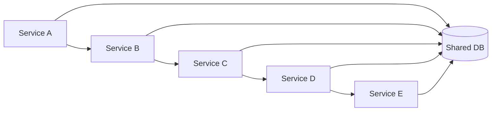

---

### Q5) How do you decide service boundaries?
**What it is**
- The process of splitting a domain into services that are cohesive and loosely coupled.

**Why we do it**
- Correct boundaries reduce coordination and runtime coupling.

**How it works / key features**
- Use **DDD bounded contexts** and business capabilities.
- Prefer boundaries where:
  - data ownership is clear
  - changes happen together within the same boundary
  - teams can own independently
- Watch for:
  - shared invariants requiring strict consistency
  - high-frequency synchronous calls (might indicate wrong split)

**Advantages**
- Better autonomy and scaling.
- Clear ownership and governance.

**Disadvantages / tradeoffs**
- Wrong splits cause distributed monolith.
- Too fine-grained services increase network chatter and ops overhead.

**If we don’t do it well (impact)**
- Either:
  - giant services with slow delivery, or
  - tiny services with high latency and cascading failures.

**Diagram**
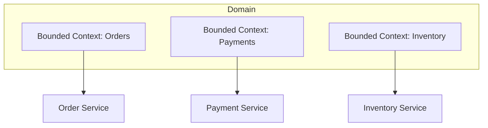

---

### Q6) How do you apply DDD bounded contexts in microservices?
**What it is**
- DDD bounded context is a **boundary where a domain model is consistent** (terminology, rules, invariants).

**Why we use it**
- It’s the strongest technique to avoid services being split by technical layers and instead align to business.

**How it works / key features**
- Each bounded context becomes:
  - a service (or a small set of services)
  - owning its model and data
- Integration happens through:
  - published APIs/events
  - anti-corruption layers when necessary

**Advantages**
- Reduces semantic coupling.
- Minimizes cross-service changes.

**Disadvantages / tradeoffs**
- Requires domain understanding and time.
- Misunderstood DDD leads to wrong boundaries.

**If we don’t use it (impact)**
- You often get technical-layer services (UserService, CommonService) with shared models and high coupling.

**Diagram**
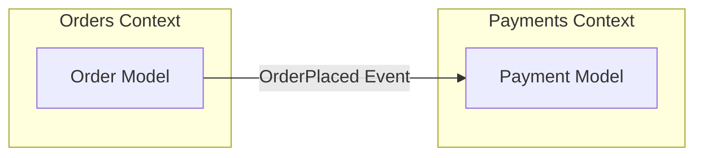

---

### Q7) How does Conway’s Law influence microservices design?
**What it is**
- Systems tend to mirror the communication structure of the organization.

**Why it matters**
- If teams are organized by layers (UI/DB), services become coupled.
- If teams are organized by business capabilities, services align better.

**How it works / key features**
- Team boundaries and service boundaries should align.

**Advantages**
- Proper alignment increases ownership and reduces dependencies.

**Disadvantages / tradeoffs**
- If org structure is poor, architecture suffers.

**If we don’t account for it (impact)**
- You will fight constant cross-team coordination and end up with a distributed monolith.

---

### Q8) What are common microservices anti-patterns?
**What it is**
- Repeated mistakes that cause coupling and operational pain.

**Common anti-patterns**
- Shared database across services.
- Shared business-logic libraries across services.
- Chatty synchronous calls in request path.
- Central “god” service.
- No observability.
- No timeouts/retries/circuit breakers.
- Treating async messaging like RPC.

**If we don’t avoid them (impact)**
- Fragile system, slow delivery, constant incidents.

---

## API Design & Contracts

### Q9) How do you design REST APIs for microservices?
**What it is**
- Designing resource-oriented APIs with stable contracts.

**Why we use it**
- REST is widely understood, works well for external/public APIs and many internal APIs.

**How it works / key features**
- Resource modeling: nouns, stable IDs.
- Correct HTTP semantics: methods, status codes.
- Pagination/filtering.
- Consistent error format.
- Idempotency where needed.

**Advantages**
- Simple tooling, broad compatibility.

**Disadvantages / tradeoffs**
- Over/under-fetching for complex UIs.
- Multiple calls can create latency.

**If we don’t do it well (impact)**
- Breaking clients, versioning chaos, unreliable integrations.

---

### Q10) REST vs gRPC: when and why?
**What it is**
- Choosing communication protocol.

**Why we use gRPC**
- High-performance internal communication, strongly typed contracts.

**Why we use REST**
- External-facing APIs, browser-friendly, simpler debugging.

**How it works / key features**
- REST: HTTP/JSON, human-readable.
- gRPC: HTTP/2 + protobuf, streaming, codegen.

**Advantages**
- gRPC: efficient, typed, streaming.
- REST: interoperable, easy to test/debug.

**Disadvantages / tradeoffs**
- gRPC: harder for browsers, requires tooling.
- REST: payload overhead, weaker contracts without discipline.

**If we don’t choose correctly (impact)**
- Wrong protocol can increase latency/cost or slow down client integration.

---

### Q11) How do you version APIs?
**What it is**
- Managing contract evolution without breaking consumers.

**Why we use it**
- Microservices evolve independently; consumers lag behind.

**How it works / key features**
- Prefer backward-compatible changes.
- Versioning approaches:
  - URI (`/v1/...`)
  - headers/content negotiation
  - versioned schemas for events

**Advantages**
- Enables independent evolution.

**Disadvantages / tradeoffs**
- Version sprawl if old versions never sunset.

**If we don’t version (impact)**
- Forced coordinated releases; frequent outages and client breakage.

---

### Q12) How do you maintain backward compatibility?
**What it is**
- Making changes that do not break existing consumers.

**Why we use it**
- Independent deployments require consumer safety.

**How it works / key features**
- Additive changes preferred:
  - add fields (don’t remove/rename)
  - tolerate unknown fields
  - avoid changing semantics
- Deprecate with timelines.

**If we don’t (impact)**
- Client failures, rollback pressure, and “release lock-step”.

---

### Q13) What is consumer-driven contract testing?
**What it is**
- A testing approach where consumers define expectations (contracts) that providers must satisfy.

**Why we use it**
- To avoid breaking downstream consumers while allowing independent deployments.

**How it works / key features**
- Consumers publish contracts.
- Provider verifies against all contracts in CI.

**Advantages**
- Early detection of breaking changes.

**Disadvantages / tradeoffs**
- Requires discipline and tooling.

**If we don’t use it (impact)**
- More reliance on brittle E2E tests or production failures.

---

### Q14) How do you handle breaking changes in APIs?
**What it is**
- Strategy for evolving a contract when backward compatibility isn’t possible.

**Why we need it**
- Sometimes semantics must change.

**How it works / key features**
- Introduce `v2` alongside `v1`.
- Dual-run period.
- Deprecation policy.
- Migration guidance.

**If we don’t (impact)**
- Consumers break; outages; loss of trust.

---

### Q15) How do you design error responses consistently across services?
**What it is**
- A standard error schema for clients and operators.

**Why we use it**
- Improves debugging, observability, and client handling.

**How it works / key features**
- Include:
  - error code
  - message (safe)
  - correlation/trace id
  - details for validation errors

**If we don’t (impact)**
- Harder debugging, inconsistent client behavior.

---

### Q16) What is HATEOAS and do you use it?
**What it is**
- Hypermedia links in responses to guide state transitions.

**Why we might use it**
- For discoverability in pure REST systems.

**Why often not used**
- Many teams prefer explicit API docs + client SDKs.

**If we don’t use it (impact)**
- Typically minimal impact if clients use docs/contracts.

---

### Q17) How do you design pagination, filtering, sorting for APIs?
**What it is**
- Designing list endpoints for efficiency and usability.

**Why we use it**
- Prevent huge responses and control load.

**How it works / key features**
- Pagination styles:
  - offset/limit (simple)
  - cursor-based (better for large/real-time datasets)
- Filtering via query params.

**If we don’t (impact)**
- Slow endpoints, large payloads, DB pressure.

---

### Q18) How do you design idempotent APIs?
**What it is**
- An API behavior where repeating the same request does not create duplicate effects.

**Why we use it**
- Retries happen (network failures, timeouts). Idempotency prevents double-charging/double-ordering.

**How it works / key features**
- For create operations:
  - idempotency key from client
  - store outcome keyed by (client, key)
  - return same result on retries

**If we don’t (impact)**
- Duplicate orders/payments, reconciliation problems, poor customer experience.

**Diagram**
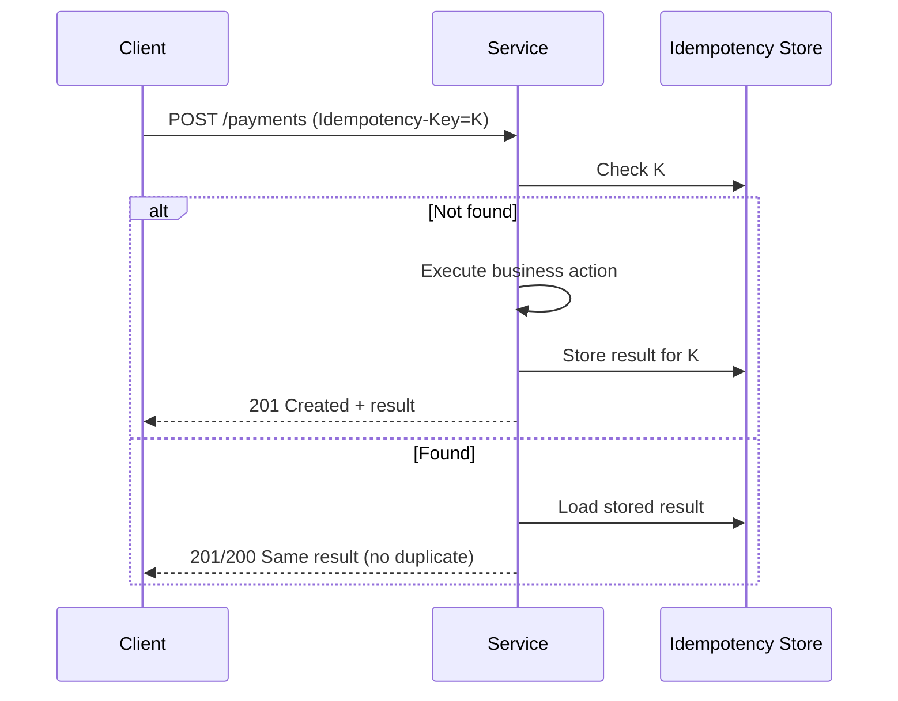

---

## Communication Patterns

### Q19) Synchronous vs asynchronous communication: when to choose each?
**What it is**
- Sync: caller waits for response.
- Async: caller emits message/event; processing happens later.

**Why we choose sync**
- Need immediate answer (auth, pricing lookup, read operations).

**Why we choose async**
- Decouple services, improve resilience, handle spikes (notifications, audit, integrations).

**Tradeoffs**
- Sync is simpler but increases coupling and latency.
- Async is scalable but adds eventual consistency and operational complexity.

**If we don’t use async where needed (impact)**
- Higher latency, cascading failures, difficulty handling traffic spikes.

**Diagram**
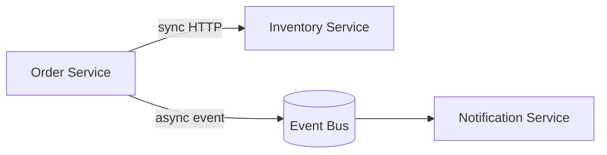

---

### Q20) Request/response vs event-driven: when to choose each?
**What it is**
- Request/response is command-like.
- Event-driven publishes facts (“OrderPlaced”).

**Why we use request/response**
- When a single service is authoritative and caller needs result now.

**Why we use events**
- When multiple services react independently and you want decoupling.

**If we don’t use events where appropriate (impact)**
- Harder to add new consumers/features without changing producers.

---

### Q21) What is event-driven architecture?
**What it is**
- Architecture where services communicate by publishing and reacting to events.

**Why we use it**
- Decoupling, scalability, extensibility.

**How it works / key features**
- Producers publish events.
- Consumers subscribe.
- Requires idempotency, retries, and observability.

**Disadvantages / tradeoffs**
- Eventual consistency.
- Harder tracing/debugging without good tooling.

**If we don’t use it (impact)**
- More direct coupling; harder integrations.

---

### Q22) What is pub/sub vs message queue?
**What it is**
- Pub/sub: one message can be delivered to many subscribers.
- Queue: messages go to one consumer (competing consumers).

**Why we use pub/sub**
- Fan-out: many services react (OrderPlaced -> analytics, notifications, shipping).

**Why we use queues**
- Work distribution: scale consumers horizontally.

**If we don’t choose right (impact)**
- With queue instead of pub/sub you may lose fan-out.
- With pub/sub instead of queue you may duplicate work.

---

### Q23) What is the outbox pattern and why is it needed?
**What it is**
- A reliability pattern to ensure DB changes and event publication stay consistent.

**Why we use it**
- Prevents the “DB updated but event not published” (or vice versa) problem.

**How it works / key features**
- In the same DB transaction:
  - write business data
  - write an outbox record
- A publisher later reads outbox and publishes to broker.

**Advantages**
- Strong reliability with eventual publication.

**Disadvantages / tradeoffs**
- More moving parts (outbox table, publisher, monitoring).

**If we don’t use it (impact)**
- Lost events, inconsistent downstream projections, hard-to-debug data gaps.

**Diagram**
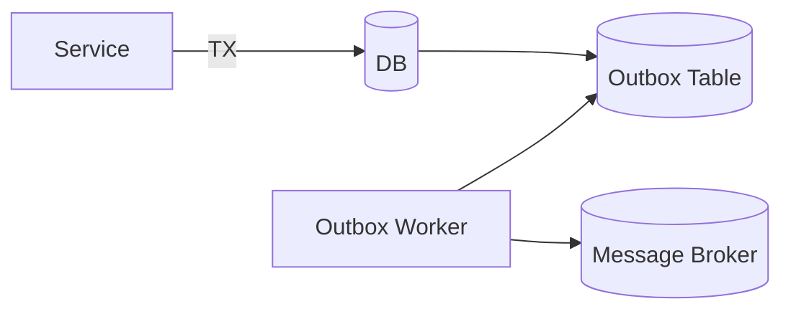

---

### Q24) How do you manage schema evolution for events?
**What it is**
- Evolving event payloads without breaking consumers.

**Why we use it**
- Producers and consumers deploy independently.

**How it works / key features**
- Additive changes preferred.
- Version events or use schema registry.
- Consumers should be tolerant to unknown fields.

**If we don’t (impact)**
- Consumer crashes, DLQ floods, data loss in projections.

---

### Q25) How do you prevent chatty service communication?
**What it is**
- Avoiding a request path that requires many sequential network calls.

**Why we use it**
- Chatty calls increase p99 latency and failure probability.

**How it works / key features**
- Use BFF/API composition carefully.
- Use async events and local read models (CQRS) where appropriate.
- Batch calls or use coarse-grained endpoints.

**If we don’t (impact)**
- High latency, brittle request flows, cascading failures.

---

## Data & Transactions

### Q26) Why database-per-service?
**What it is**
- Each service owns its data store and schema.

**Why we use it**
- Enforces autonomy and prevents tight coupling through shared tables.

**Advantages**
- Independent evolution, scaling, and ownership.

**Disadvantages / tradeoffs**
- Cross-service queries become harder.
- Requires async integration and data duplication.

**If we don’t (impact)**
- Shared DB becomes an integration point:
  - one team’s schema change breaks others
  - hidden coupling
  - hard to deploy independently

---

### Q27) When is shared database acceptable (if ever)?
**What it is**
- Multiple services using the same DB/schema.

**When it might be acceptable**
- Transitional phase during migration from monolith.
- Same team owns both services and treats DB as internal.
- Very small scale with low change rate (still risky).

**Impact if used long-term**
- You lose service autonomy; schema is a shared contract.

---

### Q28) How do you manage distributed transactions without 2PC?
**What it is**
- Achieving business consistency across services without a single ACID transaction.

**Why we avoid 2PC**
- Blocking, availability loss, operational complexity across heterogeneous systems.

**How it works / key features**
- Use:
  - Saga (orchestration/choreography)
  - idempotency
  - outbox/inbox
  - compensating actions

**If we don’t (impact)**
- You either:
  - accept inconsistency with no recovery, or
  - create tight coupling and availability issues.

---

### Q29) What is the Saga pattern?
**What it is**
- A pattern to manage a multi-step business process across services using local transactions + coordination.

**Why we use it**
- To handle distributed workflows reliably with eventual consistency.

**How it works / key features**
- Each step is a local transaction.
- On failure, perform compensations.

**Advantages**
- Works well with microservices.

**Disadvantages / tradeoffs**
- Complex to design compensations.
- Requires careful state management and observability.

**If we don’t (impact)**
- Incomplete workflows, stuck orders, manual reconciliation.

**Diagram**
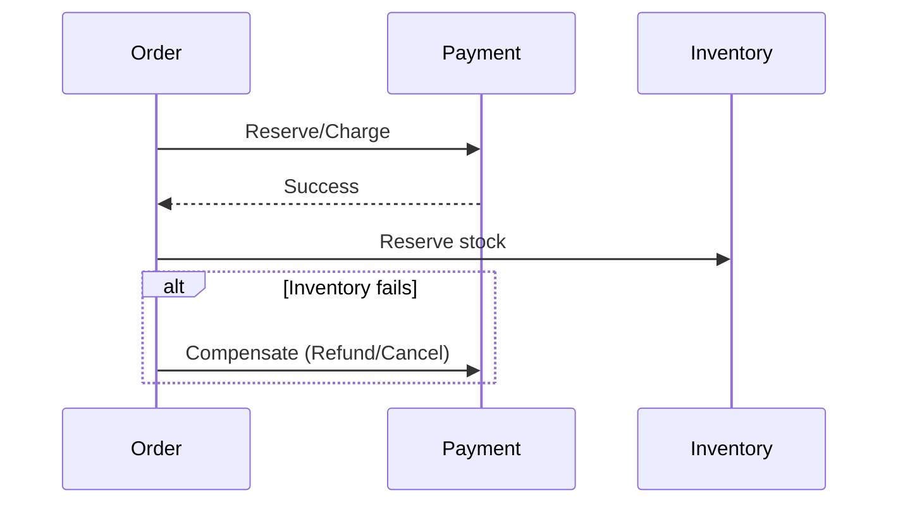

---

### Q30) Saga choreography vs orchestration: compare.
**What it is**
- Choreography: services react to events.
- Orchestration: a central saga orchestrator commands steps.

**Why we choose choreography**
- Lower centralization; easy fan-out.

**Why we choose orchestration**
- Clear control flow and state; easier to reason about complex workflows.

**Tradeoffs**
- Choreography can become “event spaghetti”.
- Orchestration introduces a central component (not necessarily a bottleneck if designed well).

**If we don’t pick well (impact)**
- Complex workflows become unmaintainable and hard to debug.

---

### Q31) How do you handle compensation actions?
**What it is**
- A compensating action semantically “undoes” a previous step.

**Why we use it**
- Because you can’t roll back across services atomically.

**How it works / key features**
- Compensation is business-specific:
  - cancel reservation
  - refund payment
  - issue reversal entry

**If we don’t (impact)**
- Inconsistent state (paid but not shipped; reserved but cancelled), manual support load.

---

### Q32) What is CQRS and when do you use it?
**What it is**
- Separating write model (commands) from read model (queries).

**Why we use it**
- Reads often have different scaling and modeling needs than writes.

**How it works / key features**
- Write side emits events.
- Read side builds projections/materialized views.

**Advantages**
- Fast reads, independent scaling, simpler read models.

**Disadvantages / tradeoffs**
- Eventual consistency between write and read.
- More infra/complexity.

**If we don’t use it (impact)**
- Complex read queries may overload transactional DB or force tight coupling.

**Diagram**
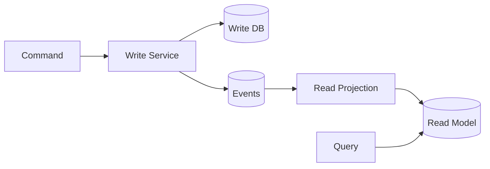

---

### Q33) What is event sourcing and when do you avoid it?
**What it is**
- Persisting the source of truth as a sequence of events instead of current state.

**Why we use it**
- Complete audit trail, ability to rebuild state and projections.

**When to avoid**
- If domain is simple and doesn’t require full history.
- If the team isn’t ready for added complexity (versioning, replay).

**If we don’t use it (impact)**
- You rely on state snapshots + audit logs; often enough for many systems.

---

### Q34) How do you handle reporting/analytics across microservices?
**What it is**
- Producing cross-domain insights without cross-service DB joins.

**Why we use specialized approaches**
- DB-per-service prevents direct joins.

**How it works / key features**
- Stream events into analytics store (warehouse/lake).
- Build reporting projections.
- Use CDC where appropriate.

**If we don’t (impact)**
- Pressure to create shared DB; brittle reporting; inaccurate metrics.

---

### Q35) How do you handle data duplication and source of truth?
**What it is**
- Duplicating data across services for autonomy while preserving an authoritative owner.

**Why we use it**
- To avoid chatty calls and to support local read models.

**How it works / key features**
- Define “system of record” service for a data entity.
- Other services keep a cached/projection copy fed by events.

**If we don’t (impact)**
- Either high latency (always call owner) or inconsistent truth (multiple owners).

---

## Consistency, Ordering, Idempotency

### Q36) What is eventual consistency? Where is it acceptable/unacceptable?
**What it is**
- State converges over time; different services may temporarily disagree.

**Acceptable**
- Notifications, analytics, recommendations, shipping ETA.

**Unacceptable (or requires extra controls)**
- Payment capture rules, account balances, strict inventory for limited stock.

**If we don’t handle it explicitly (impact)**
- Confusing UX, financial risk, overselling, reconciliation issues.

---

### Q37) At-most-once vs at-least-once vs exactly-once delivery: explain.
**What it is**
- At-most-once: may lose messages, no duplicates.
- At-least-once: no loss (ideally), but duplicates possible.
- Exactly-once: processed once (hard in distributed systems).

**Why it matters**
- Determines your need for idempotency/dedup.

**If we don’t design for the chosen guarantee (impact)**
- Data corruption (duplicates) or data loss.

---

### Q38) What is idempotency and how do you implement it?
**What it is**
- Repeating an operation yields the same effect.

**Why we use it**
- Retries are normal; idempotency prevents duplicate side-effects.

**How it works / key features**
- Idempotency keys for commands.
- Dedup store with TTL.

**If we don’t (impact)**
- Duplicate payments/orders, inconsistent downstream projections.

---

### Q39) How do you handle duplicate messages/events?
**What it is**
- Handling at-least-once delivery.

**Why we do it**
- Brokers/consumers retry; duplicates happen.

**How it works / key features**
- Store processed message IDs (inbox pattern).
- Ensure handlers are idempotent.

**If we don’t (impact)**
- Double side-effects and data corruption.

---

### Q40) How do you handle out-of-order events?
**What it is**
- Events for the same entity may arrive in a different order than emitted.

**Why it happens**
- Parallelism, partitions, retries.

**How it works / key features**
- Use version numbers/sequence IDs.
- Partitioning by entity key.
- Reject/hold stale events.

**If we don’t (impact)**
- Projections become incorrect (e.g., order status goes backwards).

---

### Q41) How do you ensure ordering in Kafka (partitioning strategy)?
**What it is**
- Kafka guarantees ordering within a partition.

**Why we use partition keys**
- To keep related events in same partition.

**How it works / key features**
- Choose key: `orderId`, `customerId` depending on ordering requirement.

**If we don’t (impact)**
- Same entity updates can be processed out of order leading to inconsistent state.

---

### Q42) What is a DLQ and when do you use it?
**What it is**
- A dead-letter queue/topic for messages that cannot be processed.

**Why we use it**
- Prevents consumer from being stuck on poison messages.

**If we don’t (impact)**
- Processing halts; backlog grows; SLA breaches.

---

### Q43) How do you handle poison messages?
**What it is**
- Messages that always fail due to bad data or code bugs.

**Why we handle them**
- To keep the system moving and allow triage.

**How it works / key features**
- Retry with backoff.
- After N attempts route to DLQ with context.

**If we don’t (impact)**
- Infinite retry loops, cost increase, blocked processing.

---

### Q44) How do you design retry strategies without causing a retry storm?
**What it is**
- Retries that amplify failures if done aggressively.

**Why we design carefully**
- During downstream outage, retries can DDoS dependencies.

**How it works / key features**
- Exponential backoff + jitter.
- Global timeout budgets.
- Circuit breakers.
- Bulkheads and rate limiting.

**If we don’t (impact)**
- Cascading failures and full-system outages.

---

## Resilience & Fault Tolerance

### Q45) What is a circuit breaker? How does it work?
**What it is**
- A pattern that stops calling an unhealthy dependency to prevent cascading failures.

**Why we use it**
- Protects upstream services and improves overall system availability.

**How it works / key features**
- States: closed (normal), open (block calls), half-open (trial calls).

**If we don’t (impact)**
- Threads/connection pools get exhausted; system-wide outages.

**Diagram**
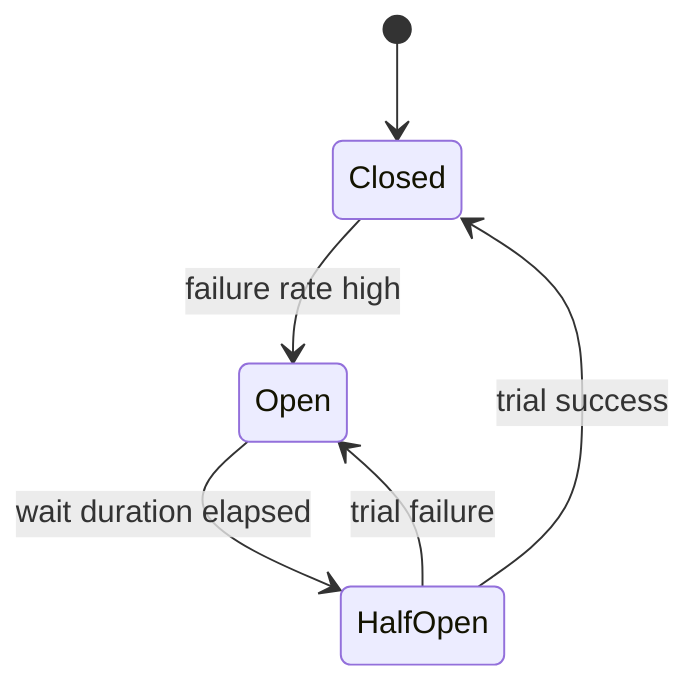

---

### Q46) What is bulkhead isolation?
**What it is**
- Isolating resources so failure in one area doesn’t sink the whole service.

**Why we use it**
- Prevents thread pool/connection pool exhaustion from one dependency.

**If we don’t (impact)**
- One slow dependency can bring down all endpoints.

---

### Q47) What is rate limiting and where do you apply it?
**What it is**
- Limiting requests per client/user to protect services.

**Why we use it**
- Protect against abuse and traffic spikes.

**Where to apply**
- API gateway (coarse).
- Service level (fine).

**If we don’t (impact)**
- Resource exhaustion, noisy-neighbor issues, outages.

---

### Q48) What timeout strategy do you use for service-to-service calls?
**What it is**
- Timeouts bound how long you wait on dependencies.

**Why we use it**
- Prevents request pile-ups and thread starvation.

**How it works / key features**
- Set timeouts shorter than upstream overall SLA budget.
- Use different timeouts for connect vs read.

**If we don’t (impact)**
- Hanging requests, queue buildup, cascading failures.

---

### Q49) How do you choose retry policies?
**What it is**
- Retrying transient failures while avoiding overload.

**Why we use it**
- Networks fail; retries can improve success rate.

**How it works / key features**
- Retry only idempotent operations.
- Limit attempts, use backoff+jitter.
- Combine with circuit breakers.

**If we don’t (impact)**
- Too few retries: avoidable failures.
- Too many retries: storms and outages.

---

### Q50) How do you design graceful degradation?
**What it is**
- Returning partial results or reduced functionality when dependencies fail.

**Why we use it**
- Keeps core user journeys alive.

**How it works / key features**
- Fallback responses.
- Serve from cache.
- Feature flags to disable non-critical paths.

**If we don’t (impact)**
- Full outage instead of partial impact.

---

### Q51) What is backpressure and how do you implement it?
**What it is**
- A mechanism to slow producers when consumers are overloaded.

**Why we use it**
- Prevents memory bloat and system instability.

**How it works / key features**
- Bounded queues.
- Reject/429.
- Kafka consumer pause.
- Load shedding.

**If we don’t (impact)**
- Unbounded queues, OOM crashes, long recovery times.

---

## Part 2

# Microservices Interview Answers (Part 2)

This document continues answers from `../../Microservices_Common_Interview_Questions.md`.

## Table of Contents

- [Service Discovery & Routing](#service-discovery--routing)
- [Security](#security)
- [Observability](#observability)

---

## Service Discovery & Routing

### Q52) What is service discovery? Client-side vs server-side discovery?
**What it is**
- Service discovery is the mechanism by which a service finds the **network location** (IP/port/endpoint) of another service at runtime.
- In dynamic environments (containers, auto-scaling), instances come and go, so addresses cannot be hardcoded.

**Why we use it**
- To support:
  - autoscaling
  - rolling deployments
  - instance churn (pods restarting)
  - load balancing across healthy instances

**How it works / key features**
- A **registry** holds service instances (logical name -> list of endpoints).
- Health checks update which instances are routable.

**Client-side discovery**
- The client queries registry and picks an instance.
- Pros: flexible, no extra hop.
- Cons: client complexity, language-specific libraries.

**Server-side discovery**
- Client calls a load balancer / gateway; it routes to instances.
- Pros: simpler clients.
- Cons: extra hop, load balancer becomes critical infra.

**Advantages**
- Decouples callers from fixed endpoints.
- Enables elastic scaling and resilient routing.

**Disadvantages / tradeoffs**
- Requires registry/health checks/operational ownership.
- If registry is unhealthy, routing can fail.

**If we don’t use it (impact)**
- Hardcoded endpoints lead to:
  - frequent failures during deploys/scaling
  - manual configuration drift
  - inability to do zero-downtime rollouts reliably
- In Kubernetes you would rely on K8s DNS/service abstraction; not using discovery there would mean bypassing the platform and reintroducing brittle configs.

**Diagram**
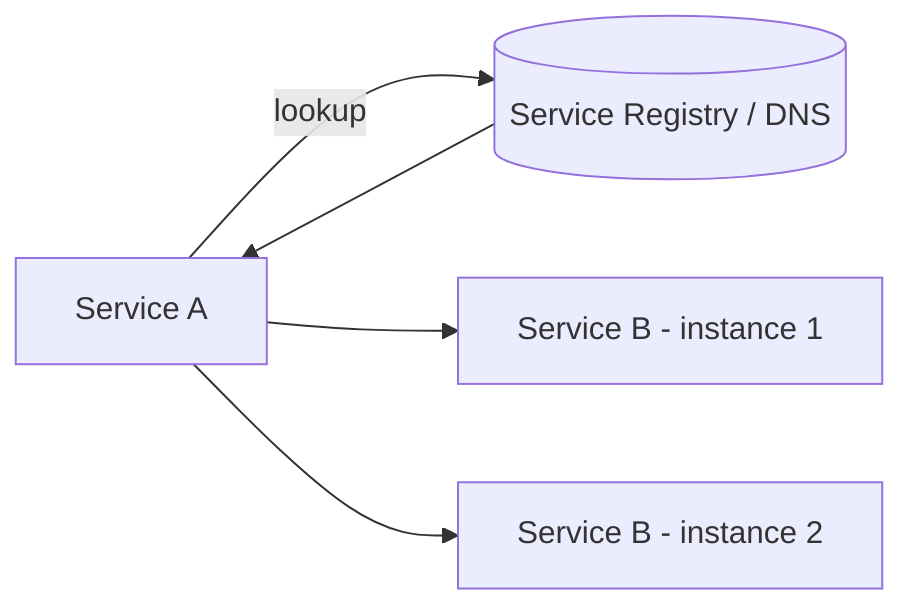

---

### Q53) What is an API Gateway and what belongs there?
**What it is**
- An API Gateway is a single entry point for clients to access backend services.

**Why we use it**
- To centralize cross-cutting concerns and present a stable edge contract.

**What belongs in a gateway**
- Authentication/authorization enforcement (edge-level)
- TLS termination
- Rate limiting / quotas
- Routing / request shaping
- Response caching (sometimes)
- Request/response transformation (lightweight)
- Observability: access logs, correlation ID injection

**What should NOT belong (ideally)**
- Core business logic
- Complex orchestration of business workflows

**Advantages**
- Simplifies clients.
- Central place for policies.

**Disadvantages / tradeoffs**
- Can become a bottleneck or single point of failure if not scaled.
- Risk of “god gateway” with business logic.

**If we don’t use it (impact)**
- Clients must call many services directly:
  - more coupling
  - harder security enforcement
  - duplicated rate limiting/auth logic

**Diagram**
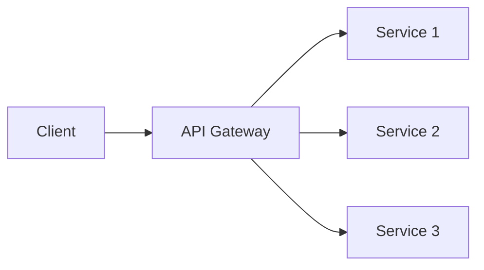

---

### Q54) Gateway vs BFF: when and why?
**What it is**
- Gateway: shared edge for many clients.
- BFF (Backend for Frontend): a backend tailored for a specific client (web, mobile).

**Why we use BFF**
- Different clients need different aggregations and performance optimizations.

**Advantages**
- Better UX performance (fewer client round trips).
- Faster client-specific evolution.

**Disadvantages / tradeoffs**
- More services to maintain.
- Risk of duplicated logic across BFFs.

**If we don’t use BFF when needed (impact)**
- Clients do orchestration themselves → chatty calls, slow UX, duplicated client logic.

**Diagram**
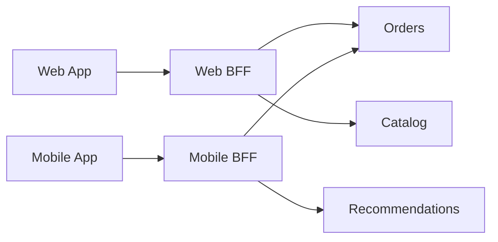

---

### Q55) How do you do API composition/aggregation?
**What it is**
- Combining data from multiple services to serve a client request.

**Why we use it**
- To reduce client round trips and provide a view optimized for UI.

**How it works / key features**
- Approaches:
  - BFF aggregation (preferred)
  - Gateway aggregation (careful)
  - GraphQL
  - Precomputed read model (CQRS) to avoid fan-out calls

**Advantages**
- Better UX latency.

**Disadvantages / tradeoffs**
- Fan-out calls increase tail latency.
- Failure handling is complex.

**If we don’t do it (impact)**
- Clients become chatty and more coupled to internal topology.

---

### Q56) How do you handle cross-cutting concerns (auth, logging, throttling)?
**What it is**
- Concerns required everywhere, not specific to one domain.

**Why we handle them systematically**
- To avoid inconsistent security and duplicated effort.

**How it works / key features**
- Auth/throttling: gateway + service-level enforcement.
- Logging/tracing: shared conventions + libraries.
- Policies: service mesh and platform tooling.

**If we don’t (impact)**
- Security gaps, inconsistent logging, hard incident response.

---

## Security

### Q57) OAuth2 vs OIDC: what’s the difference?
**What it is**
- OAuth2: authorization framework (delegated access).
- OIDC: identity layer on top of OAuth2 (authentication).

**Why we use them**
- OAuth2: secure delegated access for APIs.
- OIDC: login/SSO and user identity claims.

**How it works / key features**
- OAuth2 issues access tokens.
- OIDC adds ID token, userinfo, standardized claims.

**If we don’t use standard protocols (impact)**
- Custom auth is error-prone and leads to vulnerabilities.

---

### Q58) JWT vs opaque tokens: tradeoffs and revocation strategy?
**What it is**
- JWT: self-contained token with claims.
- Opaque token: random reference; server introspects.

**Why we use JWT**
- Low latency validation (no introspection call).

**Why we use opaque**
- Easy revocation and centralized control.

**Tradeoffs**
- JWT revocation is harder; typically use short TTL + rotation.
- Opaque tokens add network hop for introspection.

**If we choose wrong (impact)**
- JWT with long TTL can cause security exposure.
- Opaque with high traffic can overload introspection service.

---

### Q59) How do you do service-to-service authentication?
**What it is**
- Ensuring internal calls are made by trusted workloads.

**Why we use it**
- Zero-trust: internal network is not inherently safe.

**How it works / key features**
- mTLS with workload identities.
- Signed JWT between services.
- SPIFFE/SPIRE style identities (in advanced setups).

**If we don’t (impact)**
- Lateral movement risk: one compromised service can call everything.
- Spoofing and data exfiltration.

---

### Q60) What is mTLS and why is it used?
**What it is**
- Mutual TLS: both client and server present certificates.

**Why we use it**
- Strong service identity and encrypted transport.

**Advantages**
- Prevents MITM, provides workload authentication.

**Disadvantages / tradeoffs**
- Cert lifecycle management complexity.

**If we don’t (impact)**
- If relying only on network trust, security posture is weak.

**Diagram**
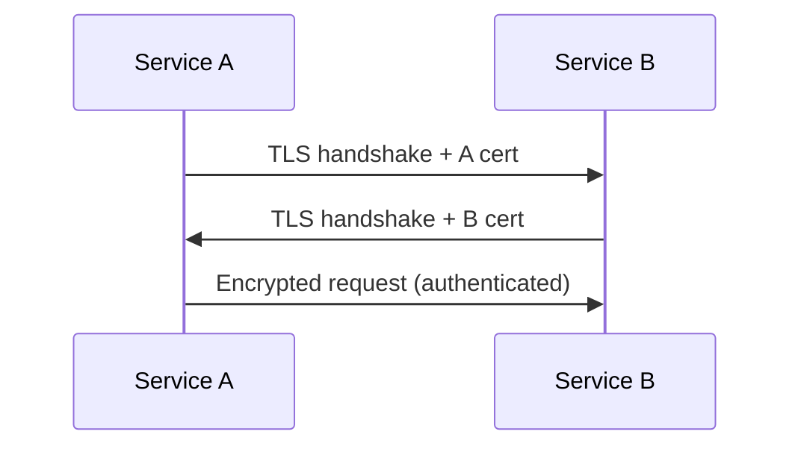

---

### Q61) How do you manage secrets (rotation, storage, access)?
**What it is**
- Handling sensitive values: DB passwords, API keys, certs.

**Why we use secret management**
- Prevent leaks and enable rotation.

**How it works / key features**
- Store in vault/KMS/secret manager.
- Least privilege access.
- Rotate periodically.

**If we don’t (impact)**
- Hardcoded secrets leak; slow incident response; compliance failures.

---

### Q62) How do you implement authorization (RBAC/ABAC) in microservices?
**What it is**
- RBAC: roles grant permissions.
- ABAC: attributes and policies grant permissions.

**Why we use it**
- Control access consistently across services.

**How it works / key features**
- Enforce:
  - at gateway for coarse checks
  - inside services for domain-specific checks

**If we don’t (impact)**
- Over-permissioned users; data exposure; audit issues.

---

### Q63) How do you secure internal endpoints?
**What it is**
- Protecting “internal-only” APIs.

**Why we do it**
- Internal endpoints often have powerful capabilities.

**How it works / key features**
- mTLS + network policies.
- Separate internal ingress.
- AuthZ checks.

**If we don’t (impact)**
- SSRF-style attacks, lateral movement, privilege escalation.

---

### Q64) How do you prevent data leakage across tenants (multi-tenancy)?
**What it is**
- Ensuring tenant isolation.

**Why we do it**
- Compliance and customer trust.

**How it works / key features**
- Tenant ID propagation.
- Row-level security / schema-per-tenant / DB-per-tenant.
- Strict authorization checks.

**If we don’t (impact)**
- Severe security incidents and legal consequences.

---

## Observability

### Q65) What is observability vs monitoring?
**What it is**
- Monitoring: known failure detection (dashboards/alerts).
- Observability: ability to understand unknown failure modes via signals.

**Why we need it**
- Microservices failures are emergent and distributed.

**If we don’t (impact)**
- Mean time to detect/resolve increases drastically.

---

### Q66) What are logs/metrics/traces and how do they work together?
**What it is**
- Logs: discrete events.
- Metrics: numeric time series.
- Traces: end-to-end request path.

**Why we use all three**
- Metrics: detect issues quickly.
- Traces: locate bottleneck/failing hop.
- Logs: deep detail.

**If we don’t (impact)**
- You either can’t detect, can’t localize, or can’t explain incidents.

**Diagram**
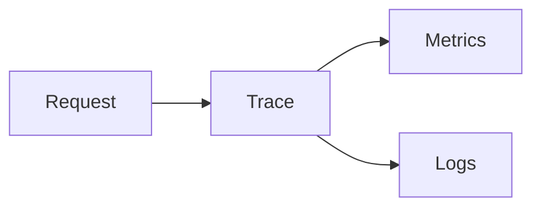

---

### Q67) What is a correlation ID and how do you propagate it?
**What it is**
- A unique ID attached to a request across services.

**Why we use it**
- To connect logs/traces across hops.

**How it works / key features**
- Inject at gateway.
- Propagate via headers and messaging metadata.

**If we don’t (impact)**
- Debugging becomes manual and slow; log search is painful.

---

### Q68) What is distributed tracing and how do you use OpenTelemetry?
**What it is**
- Tracing captures spans across services for a request.

**Why we use it**
- To identify latency contributors and failure points.

**How it works / key features**
- Instrument incoming/outgoing calls.
- Export to tracing backend.

**If we don’t (impact)**
- p99 issues and cross-service bugs are very hard to locate.

---

### Q69) What are SLIs/SLOs/SLAs?
**What it is**
- SLI: measurement (latency, availability).
- SLO: target for SLI.
- SLA: contractual agreement.

**Why we use it**
- Align engineering work with reliability goals.

**If we don’t (impact)**
- Unclear reliability expectations; alerting and prioritization chaos.

---

### Q70) What is RED method? What is USE method?
**What it is**
- RED: Rate, Errors, Duration (for request-based services).
- USE: Utilization, Saturation, Errors (for resources).

**Why we use it**
- Standardizes monitoring signals.

**If we don’t (impact)**
- Monitoring gaps; noisy alerts; missed incidents.

---

### Q71) How do you design alerting to avoid noise?
**What it is**
- Alerting strategy focused on actionable signals.

**Why we use it**
- Too many alerts cause alert fatigue.

**How it works / key features**
- Alert on SLO burn rates.
- Use aggregation and dedup.
- Separate paging vs ticket alerts.

**If we don’t (impact)**
- On-call burnout, missed real incidents.

---

### Q72) How do you debug a production issue spanning multiple services?
**What it is**
- A structured approach to incident triage in distributed systems.

**Why we use a method**
- Without method, teams waste time and cause regressions.

**How it works / key features**
- Start with user impact + SLO breach.
- Use traces to locate failing hop.
- Use metrics to confirm regression window.
- Use logs for root cause details.

**If we don’t (impact)**
- Long MTTR, repeated incidents, poor reliability.

---

## Part 3

# Microservices Interview Answers (Part 3)

This document continues answers from `../../Microservices_Common_Interview_Questions.md`.

## Table of Contents

- [Deployment & Release Engineering](#deployment--release-engineering)
- [Kubernetes / Container Platform](#kubernetes--container-platform)
- [Service Mesh](#service-mesh)
- [Performance & Scalability](#performance--scalability)
- [Testing Strategy](#testing-strategy)
- [Multi-Region / DR](#multi-region--dr)
- [System Design Prompts (Oral) — Answer Guidance + Diagrams](#system-design-prompts-oral--answer-guidance--diagrams)
- [“Coding / Practical Implementation” Questions — Concept Answers (Non-coding)](#coding--practical-implementation-questions--concept-answers-non-coding)
- [Outdated (Label as Outdated)](#outdated-label-as-outdated)

---

## Deployment & Release Engineering

### Q73) Blue/green vs canary vs rolling deployment: compare.
**What it is**
- Rolling: replace instances gradually.
- Blue/green: switch traffic between two environments.
- Canary: gradually shift a small % of traffic to new version.

**Why we use them**
- To reduce risk of releases and enable quick rollback.

**How it works / key features**
- Rolling: simplest, but rollback can be slower.
- Blue/green: instant switch; needs duplicated capacity.
- Canary: safest for large-scale; needs metrics-driven automation.

**Advantages**
- Reduced downtime.
- Reduced release risk.

**Disadvantages / tradeoffs**
- Canary requires strong observability and traffic control.
- Blue/green costs more capacity.

**If we don’t use them (impact)**
- Big-bang deployments increase outages and rollback pain.

**Diagram**
```mermaid
flowchart LR
  U[Users] --> LB[Load Balancer]
  LB --> V1[Version v1]
  LB --> V2[Version v2 (canary)]
```

---

### Q74) What is feature flagging and how do you use it safely?
**What it is**
- A technique to enable/disable features at runtime.

**Why we use it**
- Decouple deployment from release.
- Progressive rollout, quick kill-switch.

**How it works / key features**
- Flag evaluation based on user/tenant/percentage.
- Audit + ownership for flags.
- Cleanup strategy to avoid flag debt.

**If we don’t use it (impact)**
- Releases are riskier; rollback requires redeploy.

---

### Q75) How do you roll back safely in microservices?
**What it is**
- Reverting to stable versions without breaking compatibility.

**Why it’s hard**
- Multiple services deploy independently; contracts must remain compatible.

**How it works / key features**
- Backward compatible contracts.
- Database migrations designed for roll-forward or safe rollback.
- Canary + automated rollback based on SLO metrics.

**If we don’t (impact)**
- Rollback may fail due to schema incompatibility; prolonged incidents.

---

### Q76) How do you do zero-downtime DB migrations?
**What it is**
- Schema changes that don’t break running versions.

**Why we use it**
- Microservices deploy continuously; downtime is costly.

**How it works / key features**
- Expand/contract pattern:
  - Add new column/table
  - Deploy code that writes both
  - Backfill data
  - Switch reads
  - Remove old column later

**If we don’t (impact)**
- Forced downtime windows or broken deployments.

**Diagram**
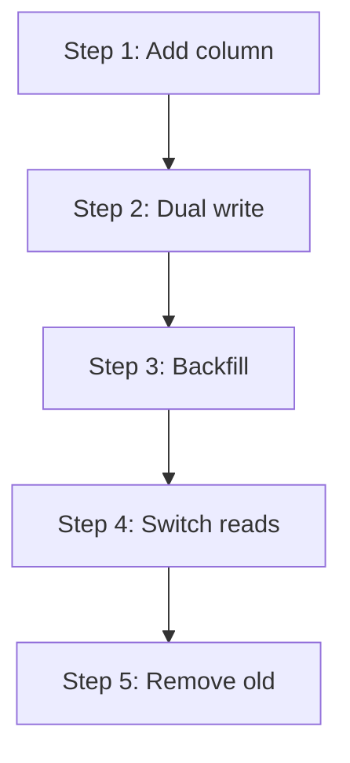

---

### Q77) How do you handle config management across environments?
**What it is**
- Managing environment-specific configuration safely.

**Why we use it**
- Different endpoints, secrets, and feature toggles across dev/stage/prod.

**How it works / key features**
- Separate config from code.
- Use config server / K8s configmaps + secrets.
- Immutable config versions.

**If we don’t (impact)**
- Config drift, fragile releases, secrets leakage.

---

### Q78) What is GitOps?
**What it is**
- Managing infra and deployments via Git as the source of truth.

**Why we use it**
- Auditability, reproducibility, safer rollbacks.

**If we don’t (impact)**
- Manual changes cause drift and outages.

---

### Q79) How do you handle secrets in CI/CD pipelines?
**What it is**
- Secure injection of secrets into builds/deploys.

**Why we use best practices**
- Pipelines are a high-value attack surface.

**How it works / key features**
- Secret managers and short-lived credentials.
- Don’t print secrets in logs.
- Least privilege.

**If we don’t (impact)**
- Secret leaks, supply chain compromise.

---

## Kubernetes / Container Platform

### Q80) What is a pod, deployment, service, ingress?
**What it is**
- Pod: smallest deployable unit (one or more containers).
- Deployment: manages replica sets and rollouts.
- Service: stable virtual IP/DNS + load balancing to pods.
- Ingress: HTTP routing from outside cluster to services.

**Why we use them**
- Standard primitives for scaling, rollout, and routing.

**If we don’t (impact)**
- Manual orchestration; poor scaling; downtime during changes.

**Diagram**
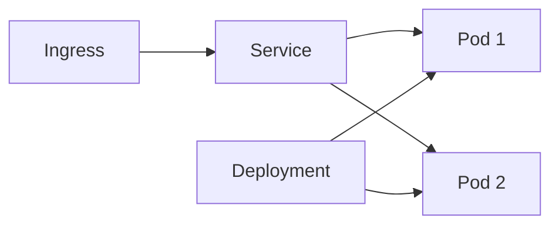

---

### Q81) Readiness vs liveness vs startup probes: differences?
**What it is**
- Startup: is app started?
- Readiness: can app receive traffic?
- Liveness: should app be restarted?

**Why we use them**
- Prevent traffic to unhealthy pods; enable safe rollouts.

**If we don’t (impact)**
- Traffic routed to broken pods → errors; restart loops; failed deployments.

---

### Q82) Requests vs limits: impact on performance and stability?
**What it is**
- Requests reserve resources; limits cap usage.

**Why we set them**
- Fair scheduling and preventing noisy-neighbor issues.

**If we don’t (impact)**
- Unpredictable performance; OOM kills; node pressure.

---

### Q83) What is HPA and when does it fail?
**What it is**
- Horizontal Pod Autoscaler scales replicas based on metrics.

**Why we use it**
- Automatic scaling for variable load.

**When it fails**
- Wrong metrics (CPU not correlated to latency).
- Cold start delays.
- Downstream bottlenecks.

**If we don’t (impact)**
- Overprovisioning or outages during spikes.

---

### Q84) How do you debug CrashLoopBackOff?
**What it is**
- Pod repeatedly crashes and restarts.

**Why it happens**
- App startup failure, misconfig, missing secrets, OOM, failing probes.

**If we don’t debug systematically (impact)**
- Extended outage, failed deployments.

---

### Q85) How do you handle node/pod failures?
**What it is**
- Designing for ephemeral infrastructure.

**Why we handle it**
- Nodes and pods fail routinely.

**How it works / key features**
- Multi-replica deployments.
- Pod disruption budgets.
- Proper probes.

**If we don’t (impact)**
- Single points of failure; downtime.

---

### Q86) What are network policies and why do they matter?
**What it is**
- Rules that control pod-to-pod communication.

**Why we use it**
- Zero trust inside cluster; reduce blast radius.

**If we don’t (impact)**
- Any compromised pod can reach everything (lateral movement).

---

## Service Mesh

### Q87) What problems does a service mesh solve?
**What it is**
- Infrastructure layer for service-to-service networking (mTLS, retries, traffic shifting, telemetry).

**Why we use it**
- Standardize networking behavior without rewriting every service.

**Advantages**
- mTLS everywhere.
- Consistent telemetry.
- Traffic shaping and canaries.

**Disadvantages / tradeoffs**
- Operational complexity, overhead, troubleshooting complexity.

**If we don’t (impact)**
- You must implement networking policies per service; inconsistent security/telemetry.

---

### Q88) When is a service mesh not worth it?
**Indicators not worth it**
- Small number of services.
- Limited security/traffic shaping requirements.
- Low platform maturity.

**If we use it anyway (impact)**
- Added latency/overhead and operational burden without benefit.

---

### Q89) What are sidecars and what overhead do they introduce?
**What it is**
- A sidecar is an additional container (proxy) running alongside your app container.

**Overhead**
- CPU/memory.
- More moving parts.
- Potential extra latency.

**If we don’t account for overhead (impact)**
- Unexpected latency and cost, autoscaling misbehavior.

---

### Q90) Should retries/timeouts be handled at mesh or application layer?
**Guidance**
- Basic policies can be in mesh (consistent defaults).
- Business-aware retries and idempotency must be in application.

**If we rely only on mesh (impact)**
- Incorrect retries can duplicate side-effects (e.g., non-idempotent POST).

---

## Performance & Scalability

### Q91) How do you reduce p95/p99 latency across microservices?
**What it is**
- Tail-latency optimization across distributed call chains.

**Why we focus on p95/p99**
- User experience and SLOs depend on tail, not average.

**How it works / key features**
- Reduce fan-out.
- Caching.
- Timeouts + hedging carefully.
- Async where possible.
- Proper DB indexing.

**If we don’t (impact)**
- Slow UX, high infra cost, SLO breaches.

---

### Q92) What is tail latency and why does it matter?
**What it is**
- The slowest percentile of requests (p95/p99/p999).

**Why it matters**
- In microservices, many calls compound tail latency.

**If we don’t (impact)**
- Overall system feels slow even when averages look fine.

---

### Q93) What caching layers do you use (client/CDN/app/DB)?
**What it is**
- Multi-layer caching strategy.

**Why we use it**
- Reduce load and latency.

**If we don’t (impact)**
- Higher latency and cost; DB becomes bottleneck.

---

### Q94) Cache-aside vs write-through vs write-behind: compare.
**What it is**
- Cache-aside: app loads cache, falls back to DB.
- Write-through: writes go to cache and DB together.
- Write-behind: writes go to cache then async to DB.

**If we don’t choose right (impact)**
- Stale data, data loss risk, complexity.

---

### Q95) How do you handle cache invalidation?
**What it is**
- Ensuring cache doesn’t serve stale/wrong data.

**Why we handle it carefully**
- Invalidation is the hardest part of caching.

**How it works / key features**
- TTLs.
- Event-driven invalidation.
- Versioned keys.

**If we don’t (impact)**
- Wrong data served; user trust issues.

---

### Q96) How do you do load testing and capacity planning?
**What it is**
- Validating performance under expected and peak load.

**Why we do it**
- Prevent outages during traffic spikes.

**If we don’t (impact)**
- Unknown bottlenecks; production incidents.

---

## Testing Strategy

### Q97) Unit vs integration vs contract vs E2E tests: what goes where?
**What it is**
- Unit: fast, isolated.
- Integration: real dependencies (DB/broker).
- Contract: provider/consumer compatibility.
- E2E: full workflow.

**Why we balance them**
- E2E alone is slow/flaky; unit alone misses integration risk.

**If we don’t (impact)**
- Either slow pipelines or frequent production regressions.

---

### Q98) How do you test asynchronous flows?
**What it is**
- Testing event-driven processing.

**Why it’s hard**
- Timing, retries, eventual consistency.

**How it works / key features**
- Use contract tests + integration tests with brokers.
- Assert eventual outcomes with time-bounded waits.

**If we don’t (impact)**
- Flaky tests or untested failure modes.

---

### Q99) How do you test Sagas?
**What it is**
- Testing multi-step distributed workflows and compensations.

**How it works / key features**
- Test success path.
- Test each failure point triggers correct compensation.

**If we don’t (impact)**
- Stuck orders, partial states in production.

---

### Q100) What is test data management strategy in microservices?
**What it is**
- Managing realistic, isolated test datasets across many services.

**Why we need it**
- Cross-service tests require consistent fixtures.

**If we don’t (impact)**
- Flaky tests, slow debugging, environment drift.

---

### Q101) How do you use test containers?
**What it is**
- Running real dependencies (DB/Kafka) in containers during tests.

**Why we use it**
- More realistic integration tests.

**If we don’t (impact)**
- Mock-only tests miss real-world behavior.

---

### Q102) How do you avoid flaky tests?
**What it is**
- Practices to ensure tests are deterministic.

**How it works / key features**
- Avoid timing dependence.
- Isolate shared state.
- Stable test data.

**If we don’t (impact)**
- Low trust in CI; slow delivery.

---

## Multi-Region / DR

### Q103) Multi-AZ vs multi-region: difference?
**What it is**
- Multi-AZ: redundancy within a region.
- Multi-region: redundancy across regions.

**Why we use it**
- Multi-AZ for common failures.
- Multi-region for regional disasters.

**If we don’t (impact)**
- Region outage causes full downtime.

---

### Q104) Active-active vs active-passive: when to use which?
**What it is**
- Active-active: both regions serve traffic.
- Active-passive: one serves, one standby.

**Tradeoffs**
- Active-active is complex (data consistency).
- Active-passive simpler but slower failover.

**If we choose wrong (impact)**
- Excess cost/complexity or insufficient resiliency.

---

### Q105) What are RPO and RTO?
**What it is**
- RPO: acceptable data loss window.
- RTO: acceptable downtime window.

**Why we define them**
- Drive DR design and cost.

---

### Q106) How do you test failover (game days/chaos engineering)?
**What it is**
- Practicing failure scenarios.

**Why we do it**
- DR that isn’t tested often fails in real incidents.

**If we don’t (impact)**
- False confidence; long outages.

---

## System Design Prompts (Oral) — Answer Guidance + Diagrams

### Q107) Design an order management system with inventory, payment, shipping.
**What it is**
- A multi-service workflow requiring reliability, idempotency, and eventual consistency.

**Why this is asked**
- Tests boundaries, saga, outbox, and failure handling.

**What to include in your answer**
- Services: Order, Payment, Inventory, Shipping, Notification.
- DB-per-service.
- Communication: command + events.
- Saga strategy + compensation.
- Idempotency keys.
- Outbox pattern.

**Diagram**
```mermaid
flowchart LR
  C[Client] --> O[Order Service]
  O -->|OrderCreated event| K[(Event Bus)]
  K --> P[Payment Service]
  K --> I[Inventory Service]
  P -->|PaymentAuthorized/Failed| K
  I -->|StockReserved/Failed| K
  K --> S[Shipping Service]
  S -->|ShipmentCreated| K
```

---

### Q108) Design a payment system focusing on idempotency and reconciliation.
**What to include**
- Idempotency per client request.
- Ledger entries (append-only) for correctness.
- Async reconciliation with provider.
- DLQ + retry policies.

**Diagram**
```mermaid
flowchart TB
  C[Client] --> API[Payments API]
  API --> IDEMP[(Idempotency Store)]
  API --> LEDGER[(Ledger)]
  API --> PSP[Payment Provider]
  PSP --> REC[Reconciliation Job]
  REC --> LEDGER
```

---

### Q109) Design an event-driven notification system with retries and DLQ.
**What to include**
- Topic per event type.
- Consumer groups.
- Retry topic/backoff.
- DLQ for poison messages.

**Diagram**
```mermaid
flowchart LR
  E[(Event Bus)] --> N[Notification Service]
  N --> RT[Retry Topic]
  RT --> N
  N --> DLQ[Dead Letter Queue]
  N --> P[Providers: Email/SMS/Push]
```

---

### Q110) Design a rate-limited public API platform with API keys and quotas.
**What to include**
- API gateway issuing/validating API keys.
- Per-key quota and throttling.
- Usage metrics + billing.

**Diagram**
```mermaid
flowchart LR
  U[Client] --> GW[API Gateway]
  GW --> Q[(Quota Store)]
  GW --> S[Backend Services]
  GW --> M[(Usage Metrics)]
```

---

### Q111) Design a multi-tenant SaaS backend with isolation and observability.
**What to include**
- Tenant ID propagation.
- Data isolation strategy.
- Per-tenant throttling.
- Logs/metrics/traces tagged by tenant.

---

### Q112) Design a real-time analytics pipeline using Kafka and stream processing.
**What to include**
- Producers publish events.
- Stream processor aggregates.
- Store into OLAP store.

**Diagram**
```mermaid
flowchart LR
  S[Services] --> K[(Kafka)]
  K --> SP[Stream Processor]
  SP --> OLAP[(Analytics Store)]
  OLAP --> BI[Dashboards]
```

---

## “Coding / Practical Implementation” Questions — Concept Answers (Non-coding)

### Q113) Implement a REST API with validation, pagination, and error handling.
**What to include**
- Request validation rules.
- Standard pagination model.
- Error schema with correlation ID.

---

### Q114) Implement global exception handling with consistent error schema.
**What to include**
- Central exception mapping.
- Stable error codes.
- No sensitive details.

---

### Q115) Implement an idempotent POST endpoint using an idempotency key.
**What to include**
- Idempotency key.
- Store request/result.
- Return same response for retries.

---

### Q116) Implement request correlation ID propagation across services.
**What to include**
- Generate at edge.
- Propagate via headers and messaging metadata.
- Log + trace with it.

---

### Q117) Implement OpenAPI/Swagger and enforce schema validation.
**What to include**
- API contract as source of truth.
- Validate requests/responses.

---

### Q118) Implement timeouts and retries for outbound HTTP calls.
**What to include**
- Timeouts.
- Backoff + jitter.
- Retry only idempotent operations.

---

### Q119) Implement circuit breaker + fallback for a downstream service.
**What to include**
- Circuit breaker policy.
- Fallback strategy.

---

### Q120) Implement bulkhead isolation for expensive external calls.
**What to include**
- Dedicated thread/connection pools.

---

### Q121) Implement rate limiting per user/API key.
**What to include**
- Token bucket/leaky bucket.
- Distributed store if multi-instance.

---

### Q122) Implement a Kafka producer with schema/version strategy.
**What to include**
- Schema registry or versioned event types.
- Backward compatibility rules.

---

### Q123) Implement a Kafka consumer with idempotent processing.
**What to include**
- Inbox/dedup store.
- Idempotent handlers.

---

### Q124) Implement consumer retry + DLQ handling.
**What to include**
- Retry with backoff.
- DLQ after max attempts.

---

### Q125) Implement message deduplication using a store (Redis/DB) with TTL.
**What to include**
- Store message ID.
- TTL.

---

### Q126) Implement ordering guarantees using partition keys.
**What to include**
- Key selection based on entity.

---

### Q127) Implement exactly-once-like processing using transactional outbox + consumer idempotency.
**What to include**
- Outbox for publish reliability.
- Inbox for consume dedup.

---

### Q128) Implement transactional outbox table write within the same DB transaction.
**What to include**
- Same transaction writes business data + outbox record.

---

### Q129) Implement outbox publisher worker that publishes and marks processed.
**What to include**
- Polling/CDC.
- Exactly-once publication is approximated; consumers still idempotent.

---

### Q130) Implement inbox pattern for consumers to avoid duplicate processing.
**What to include**
- Store consumed message IDs.
- Ignore duplicates.

---

### Q131) Implement Saga orchestration with state machine persisted in DB.
**What to include**
- Orchestrator state.
- Step transitions.
- Compensation states.

---

### Q132) Implement compensation logic for a failed multi-step workflow.
**What to include**
- Business-defined compensations.
- Idempotent compensation handlers.

---

### Q133) Implement Saga choreography with events and compensating events.
**What to include**
- Clear event naming.
- Avoid event spaghetti with good conventions.

---

### Q134) Implement CQRS with separate write model and read projection.
**What to include**
- Event stream.
- Read projection store.

---

### Q135) Build a materialized view from events and handle rebuild/replay.
**What to include**
- Replay strategy.
- Versioned projections.

---

### Q136) Implement optimistic locking to prevent lost updates.
**What to include**
- Version field.
- Retry update on conflict.

---

### Q137) Implement OAuth2 resource server with JWT validation.
**What to include**
- Validate issuer/audience/signature.
- Claim-based authZ.

---

### Q138) Implement role-based access control on endpoints.
**What to include**
- Roles/scopes.
- Least privilege.

---

### Q139) Implement service-to-service auth (mTLS or signed tokens).
**What to include**
- Workload identity.
- Rotation strategy.

---

### Q140) Implement secure secret loading without hardcoding.
**What to include**
- Secret manager.
- No secrets in code or logs.

---

### Q141) Emit structured logs with correlation IDs.
**What to include**
- JSON logs.
- Correlation ID fields.

---

### Q142) Add custom metrics (latency, error rate, saturation).
**What to include**
- RED/USE.
- SLO-aligned dashboards.

---

### Q143) Add distributed tracing instrumentation for HTTP and Kafka flows.
**What to include**
- Propagate context across boundaries.

---

### Q144) Implement audit logging with immutability requirements.
**What to include**
- Append-only storage.
- Tamper-evident design.

---

### Q145) Implement readiness/liveness endpoints correctly.
**What to include**
- Readiness reflects ability to serve.
- Liveness detects deadlocks.

---

### Q146) Implement graceful shutdown handling in Spring Boot (stop accepting traffic, finish in-flight).
**What to include**
- Drain connections.
- Stop consumers.

---

### Q147) Implement health checks that reflect downstream dependencies safely.
**What to include**
- Avoid hard dependency checks in liveness.
- Use dependency checks for readiness with caution.

---

### Q148) Implement caching with cache-aside and proper invalidation.
**What to include**
- TTL + invalidation events.

---

### Q149) Implement a high-throughput endpoint and address thread/connection pool tuning.
**What to include**
- Connection pooling.
- Non-blocking IO where needed.

---

### Q150) Implement async processing to avoid blocking request threads.
**What to include**
- Queue-based background processing.

---

### Q151) Write contract tests for producer/consumer APIs.
**What to include**
- Consumer expectations.
- Provider verification in CI.

---

### Q152) Write integration tests using test containers for DB/Kafka.
**What to include**
- Real dependencies in tests.

---

### Q153) Write tests for idempotency and duplicate event handling.
**What to include**
- Repeat same request/event and assert no duplicate side-effects.

---

### Q154) Write tests for saga compensation flows.
**What to include**
- Fail at each step and assert compensations.

---

## Outdated (Label as Outdated)

### Q155) Outdated: Explain SOA vs Microservices (as the main focus).
**Why it’s outdated**
- Modern interviews focus more on distributed systems tradeoffs than textbook SOA comparisons.

---

### Q156) Outdated: ESB-centric integration patterns for microservices.
**Why it’s outdated**
- Modern systems prefer decentralized APIs/events over centralized ESB.

---

### Q157) Outdated: Netflix OSS stack as default (Zuul/Hystrix/Eureka) in all cases.
**Why it’s outdated**
- Many organizations moved to Kubernetes-native discovery, Resilience4j, and/or service mesh.
