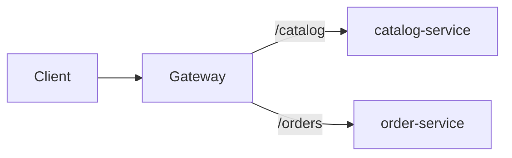
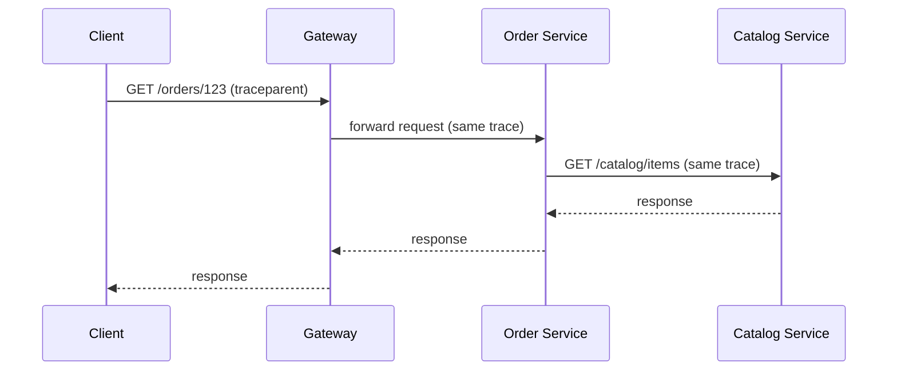

# Microservices Configuration Playbook (Spring Boot + Spring Cloud) — 2 Services Example

This document is a **how-to configuration guide** for a simple microservices setup using Spring.

It covers:
- Service discovery
- Centralized configuration (Config Server)
- API Gateway
- Distributed tracing
- Authentication & authorization

## Table of Contents

- [1) Target architecture (2 services)](#1-target-architecture-2-services)
- [2) Suggested ports (local dev)](#2-suggested-ports-local-dev)
- [3) Dependency alignment (important)](#3-dependency-alignment-important)
- [4) Service Discovery (Eureka)](#4-service-discovery-eureka)
- [5) Centralized Configuration (Spring Cloud Config Server)](#5-centralized-configuration-spring-cloud-config-server)
- [6) API Gateway (Spring Cloud Gateway)](#6-api-gateway-spring-cloud-gateway)
- [7) Distributed Tracing (Micrometer Tracing + OpenTelemetry)](#7-distributed-tracing-micrometer-tracing--opentelemetry)
- [8) Authentication & Authorization (OAuth2/OIDC)](#8-authentication--authorization-oauth2oidc)
- [9) Minimal “2 service” functional flows to validate setup](#9-minimal-2-service-functional-flows-to-validate-setup)
- [10) Required annotations — quick list](#10-required-annotations--quick-list)
- [11) Spring Boot 4 note (what to verify when you upgrade)](#11-spring-boot-4-note-what-to-verify-when-you-upgrade)
- [12) Next enhancements (once this baseline works)](#12-next-enhancements-once-this-baseline-works)
- [13) Resilience (timeouts, retry, circuit breaker, bulkhead, fallback, rate limiting)](#13-resilience-timeouts-retry-circuit-breaker-bulkhead-fallback-rate-limiting)

It uses a simple example with **two microservices**:
- `catalog-service`
- `order-service`

Plus infrastructure apps:
- `discovery-server` (Eureka)
- `config-server` (Spring Cloud Config)
- `api-gateway` (Spring Cloud Gateway)

> Note: You asked for “Spring Boot 4”. As of common industry usage, the stable mainstream is **Spring Boot 3.x** with **Spring Cloud 2023.x**.
> If/when you move to Spring Boot 4, validate the matching Spring Cloud release train and dependency coordinates. The concepts and topology below remain the same.

---

## 1) Target architecture (2 services)

```mermaid
flowchart LR
  U[Client] --> GW[api-gateway]
  GW -->|lb://catalog-service| C[catalog-service]
  GW -->|lb://order-service| O[order-service]

  subgraph Platform
    E[discovery-server
Eureka]
    CS[config-server]
    OT[Tracing Backend
(Zipkin/Tempo/Jaeger)]
    IDP[Identity Provider
(Keycloak/Okta/etc.)]
  end

  GW <--> E
  C <--> E
  O <--> E

  GW --> CS
  C --> CS
  O --> CS

  GW --> OT
  C --> OT
  O --> OT

  U --> IDP
  GW --> IDP
  C --> IDP
  O --> IDP
```

---

## 2) Suggested ports (local dev)

| Component | App name | Port |
| --- | --- | --- |
| Discovery server | `discovery-server` | `8761` |
| Config server | `config-server` | `8888` |
| API gateway | `api-gateway` | `8080` |
| Microservice | `catalog-service` | `8081` |
| Microservice | `order-service` | `8082` |
| Tracing backend (example) | Zipkin | `9411` |
| Identity provider (example) | Keycloak | `8084` (varies) |

---

## 3) Dependency alignment (important)

### Recommended baseline

| Layer | Recommendation |
| --- | --- |
| Spring Boot | `3.2.x` or `3.3.x` |
| Spring Cloud release train | `2023.0.x` |

### Maven dependency management (pattern)
Use:
- Spring Boot parent
- Spring Cloud BOM in `dependencyManagement`

(Keep all services aligned to the same Cloud release train.)

---

## 4) Service Discovery (Eureka)

### 4.1 Discovery server
**Purpose**
- Dynamic service registration/discovery.
- Clients find each other by **logical name** instead of IP/port.

**Key annotations**
- `@SpringBootApplication`
- `@EnableEurekaServer`

**Key configuration (`application.yml`)**

```yaml
server:
  port: 8761

eureka:
  client:
    register-with-eureka: false
    fetch-registry: false
```

### 4.2 Discovery client (services + gateway)
**Purpose**
- Each app registers itself to Eureka and can resolve others.

**Key annotations**
- Modern Spring Cloud typically auto-configures discovery client if dependencies are present.
- If you want explicit enabling:
  - `@EnableDiscoveryClient` (optional in many setups)

**Key configuration (`application.yml`)**

```yaml
spring:
  application:
    name: catalog-service # (or order-service/api-gateway)

eureka:
  client:
    service-url:
      defaultZone: http://localhost:8761/eureka
```

**Why we use it**
- Enables:
  - scaling (multiple instances)
  - rolling deploys
  - avoiding hardcoded endpoints

**If we do NOT use it**
- You must hardcode hostnames/ports or maintain them via config manually.
- Rolling deployments and scaling become fragile.

---

## 5) Centralized Configuration (Spring Cloud Config Server)

### 5.1 Config server
**Purpose**
- Central place for configuration across environments.

**Key annotations**
- `@SpringBootApplication`
- `@EnableConfigServer`

**Config server configuration (`application.yml`)**

```yaml
server:
  port: 8888
```

**Backing store options**
- Git repository (most common)
- filesystem/native

**Example properties**

Git-backed:
```yaml
spring:
  cloud:
    config:
      server:
        git:
          uri: <git repo url>
```

Native (filesystem):
```yaml
spring:
  profiles:
    active: native
  cloud:
    config:
      server:
        native:
          searchLocations: file:./config-repo
```

### 5.2 Config client (gateway + services)
**Purpose**
- Each service loads config from config-server at startup.

**Key configuration**

In `application.yml` (or `bootstrap.yml` in older setups), use:

```yaml
spring:
  config:
    import: "optional:configserver:http://localhost:8888"
```

**How configuration files are typically named in config-repo**
- `catalog-service.yml`
- `order-service.yml`
- `api-gateway.yml`
- environment specific:
  - `catalog-service-dev.yml`
  - `catalog-service-prod.yml`

**Why we use it**
- Consistent config across many services.
- Safer changes and auditing.

**If we do NOT use it**
- Config drift across services.
- Harder promotions across environments.

---

## 6) API Gateway (Spring Cloud Gateway)

### 6.1 Purpose
- Single entry point for clients.
- Centralizes:
  - routing
  - auth
  - rate limiting
  - correlation IDs

### 6.2 Key dependencies
- Spring Cloud Gateway
- Eureka/Discovery client

### 6.3 Routing configuration (application.yml)
**Typical route patterns**
- Route by path prefix:
  - `/catalog/**` → `lb://catalog-service`
  - `/orders/**` → `lb://order-service`

**Important notes**
- `lb://...` uses discovery + load balancing.
- Add filters for:
  - path rewrite
  - adding headers (correlation id)

### 6.4 Why we use it
- Keeps clients decoupled from internal topology.

### 6.5 If we do NOT use it
- Clients call multiple services directly.
- Duplicated security and throttling logic.

**Diagram (Gateway routing)**


---

## 7) Distributed Tracing (Micrometer Tracing + OpenTelemetry)

### 7.1 Purpose
- Trace one request across gateway → services.
- Identify p95/p99 latency contributors and failing hop.

### 7.2 What to configure
In all apps (gateway + services):
- Enable tracing sampling.
- Export traces to a backend (Zipkin/Jaeger/Tempo).

### 7.3 Typical Spring Boot 3 approach
- Micrometer Tracing instrumentation is the default direction.
- Use OpenTelemetry exporter.

### 7.4 Key configuration points (application.yml)
Common knobs:
- `management.tracing.sampling.probability` (dev: 1.0, prod: smaller)
- Export endpoint depending on backend.

Example:
```yaml
management:
  tracing:
    sampling:
      probability: 1.0
```

### 7.5 Propagation across async
If you later add Kafka/RabbitMQ:
- Ensure context propagation in message headers.

**Diagram (Trace across hops)**


---

## 8) Authentication & Authorization (OAuth2/OIDC)

### 8.1 Recommended simple approach
Use an external Identity Provider (IdP):
- Keycloak (local/dev)
- Okta/Auth0/Azure AD (enterprise)

Then configure:
- Gateway as the **edge** enforcing authentication.
- Services as **resource servers** validating JWT.

### 8.2 Concepts you should mention in interviews
- **Authentication**: who you are (OIDC)
- **Authorization**: what you can do (scopes/roles/claims)
- **JWT vs opaque tokens**

### 8.3 Gateway security
**What gateway does**
- Validates access token for incoming requests.
- Optionally does coarse authorization (route-level).

**Key configuration (conceptual)**
- `spring.security.oauth2.resourceserver.jwt.issuer-uri: <issuer>`

Example:
```yaml
spring:
  security:
    oauth2:
      resourceserver:
        jwt:
          issuer-uri: <issuer>
```

### 8.4 Service security (catalog-service + order-service)
**What services do**
- Validate JWT signature/issuer/audience.
- Enforce authorization at method/controller level.

**Common annotations**
- `@EnableMethodSecurity` (enables method-level authorization)
- `@PreAuthorize("hasAuthority('SCOPE_orders:read')")` (example)

### 8.5 Why we use it
- Standard and secure approach for distributed systems.

### 8.6 If we do NOT use it
- You risk:
  - inconsistent auth across services
  - security gaps
  - difficult auditing

---

## 9) Minimal “2 service” functional flows to validate setup

### Flow A: Gateway routes to catalog-service
- Client calls `GET /catalog/items`
- Gateway authenticates request
- Gateway routes to `catalog-service` via discovery
- Trace shows spans: `gateway` → `catalog-service`

### Flow B: order-service calls catalog-service
- Client calls `POST /orders`
- order-service calls catalog-service using service name (discovery)
- Trace shows spans: `gateway` → `order-service` → `catalog-service`

---

## 10) Required annotations — quick list

### discovery-server
- `@SpringBootApplication`
- `@EnableEurekaServer`

### config-server
- `@SpringBootApplication`
- `@EnableConfigServer`

### api-gateway
- `@SpringBootApplication`
- `@EnableDiscoveryClient` (optional depending on setup)
- Security: resource server configuration (no single annotation; via Spring Security config)

### catalog-service / order-service
- `@SpringBootApplication`
- `@EnableDiscoveryClient` (optional depending on setup)
- Security:
  - `@EnableMethodSecurity` (optional but common)

---

## 11) Spring Boot 4 note (what to verify when you upgrade)

When moving to Spring Boot 4:
- Verify the compatible Spring Cloud release train.
- Verify if any properties changed (e.g., tracing/exporter properties).
- Verify Gateway and Security starters compatibility.

---

## 12) Next enhancements (once this baseline works)

- Add resilience:
  - timeouts + retries + circuit breakers
- Add centralized logging (ELK/OpenSearch)
- Add async messaging (Kafka) + outbox/inbox
- Add rate limiting at gateway
- Add contract testing (consumer-driven contracts)

---

## 13) Resilience (timeouts, retry, circuit breaker, bulkhead, fallback, rate limiting)

This section covers the missing production-grade microservices concerns and shows **coding examples** using:
- `order-service` calling `catalog-service`
- Resilience4j for resilience patterns

### 13.1 Why this is needed

In microservices, networks and dependencies fail in real ways:
- **timeouts** happen (slow downstream)
- **transient failures** happen (connection resets)
- **retry storms** happen (everyone retries at once)
- **cascading failures** happen (thread pools/connection pools get exhausted)

Your resilience design should answer:
- What do we do when `catalog-service` is slow/unavailable?
- How do we keep `order-service` healthy even if `catalog-service` is failing?

---

### 13.2 Dependencies (Resilience4j)

Add the Resilience4j starter to **order-service** (caller side).

Maven:
```xml
<dependency>
  <groupId>org.springframework.cloud</groupId>
  <artifactId>spring-cloud-starter-circuitbreaker-resilience4j</artifactId>
</dependency>
<dependency>
  <groupId>io.github.resilience4j</groupId>
  <artifactId>resilience4j-micrometer</artifactId>
</dependency>
```

---

### 13.3 Timeouts (baseline requirement)

**Rule**: retries and circuit breakers are not useful if you don’t have tight timeouts.

Example using `WebClient` with connect/response timeout:

```java
import io.netty.channel.ChannelOption;
import io.netty.handler.timeout.ReadTimeoutHandler;
import io.netty.handler.timeout.WriteTimeoutHandler;
import java.time.Duration;
import org.springframework.context.annotation.Bean;
import org.springframework.context.annotation.Configuration;
import org.springframework.http.client.reactive.ReactorClientHttpConnector;
import org.springframework.web.reactive.function.client.WebClient;
import reactor.netty.http.client.HttpClient;

@Configuration
public class HttpClientConfig {

  @Bean
  WebClient webClient(WebClient.Builder builder) {
    HttpClient httpClient = HttpClient.create()
        .option(ChannelOption.CONNECT_TIMEOUT_MILLIS, 1000)
        .responseTimeout(Duration.ofSeconds(2))
        .doOnConnected(conn -> conn
            .addHandlerLast(new ReadTimeoutHandler(2))
            .addHandlerLast(new WriteTimeoutHandler(2)));

    return builder
        .clientConnector(new ReactorClientHttpConnector(httpClient))
        .build();
  }
}
```

---

### 13.4 Retry (for transient failures)

**When to retry**
- transient network errors
- HTTP 503/502 (depending on policy)

**When NOT to retry**
- non-idempotent operations unless you have an idempotency key

Resilience4j config example (`order-service` `application.yml`):

```yaml
resilience4j:
  retry:
    instances:
      catalogRetry:
        max-attempts: 3
        wait-duration: 200ms
        enable-exponential-backoff: true
        exponential-backoff-multiplier: 2
```

---

### 13.5 Circuit breaker (prevent cascading failures)

**Goal**
- Stop calling a dependency that is clearly failing, so your service stays healthy.

Resilience4j circuit breaker config (`order-service` `application.yml`):

```yaml
resilience4j:
  circuitbreaker:
    instances:
      catalogCircuit:
        sliding-window-type: COUNT_BASED
        sliding-window-size: 20
        minimum-number-of-calls: 10
        failure-rate-threshold: 50
        wait-duration-in-open-state: 10s
        permitted-number-of-calls-in-half-open-state: 3
```

**If you don’t use it (impact)**
- thread pool exhaustion in `order-service`
- increased latency for all endpoints
- full outage instead of partial degradation

---

### 13.6 Bulkhead (isolate resources)

**Goal**
- Prevent one dependency (`catalog-service`) from consuming all threads/connections.

Resilience4j bulkhead example (`order-service` `application.yml`):

```yaml
resilience4j:
  bulkhead:
    instances:
      catalogBulkhead:
        max-concurrent-calls: 20
        max-wait-duration: 0
```

---

### 13.7 Fallback (graceful degradation)

Fallbacks should:
- return cached/static/partial data when possible
- be fast
- be observable (log + metric)

Example service call (`order-service`) using annotations:

```java
import io.github.resilience4j.bulkhead.annotation.Bulkhead;
import io.github.resilience4j.circuitbreaker.annotation.CircuitBreaker;
import io.github.resilience4j.retry.annotation.Retry;
import java.time.Duration;
import java.util.Map;
import org.springframework.stereotype.Service;
import org.springframework.web.reactive.function.client.WebClient;

@Service
public class CatalogClient {
  private final WebClient webClient;

  public CatalogClient(WebClient webClient) {
    this.webClient = webClient;
  }

  @CircuitBreaker(name = "catalogCircuit", fallbackMethod = "getItemFallback")
  @Retry(name = "catalogRetry")
  @Bulkhead(name = "catalogBulkhead")
  public Map<String, Object> getItem(String sku) {
    return webClient.get()
        .uri("http://catalog-service/api/catalog/{sku}", sku)
        .retrieve()
        .bodyToMono(Map.class)
        .block(Duration.ofSeconds(3));
  }

  @SuppressWarnings("unused")
  private Map<String, Object> getItemFallback(String sku, Throwable ex) {
    return Map.of(
        "sku", sku,
        "available", false,
        "source", "fallback"
    );
  }
}
```

Notes:
- The URL uses the **service name** `catalog-service`. That requires discovery + load-balancing.
- For production, prefer typed DTOs instead of `Map`.

---

### 13.8 Rate limiting (protect your service)

You can rate limit at:
- **Gateway** (most common; protects everything behind it)
- **Service** (fine-grained per endpoint)

Example using Resilience4j `RateLimiter` on `order-service`:

```yaml
resilience4j:
  ratelimiter:
    instances:
      orderCreateLimiter:
        limit-for-period: 50
        limit-refresh-period: 1s
        timeout-duration: 0
```

Example annotation usage:

```java
import io.github.resilience4j.ratelimiter.annotation.RateLimiter;
import org.springframework.stereotype.Service;

@Service
public class OrderService {

  @RateLimiter(name = "orderCreateLimiter")
  public String createOrder() {
    return "OK";
  }
}
```

---

### 13.9 Observability for resilience

Minimum you should capture:
- circuit breaker state changes
- retry counts
- bulkhead rejections
- rate limiter rejections

If you use Micrometer, Resilience4j metrics can be scraped and put on dashboards/alerts.
